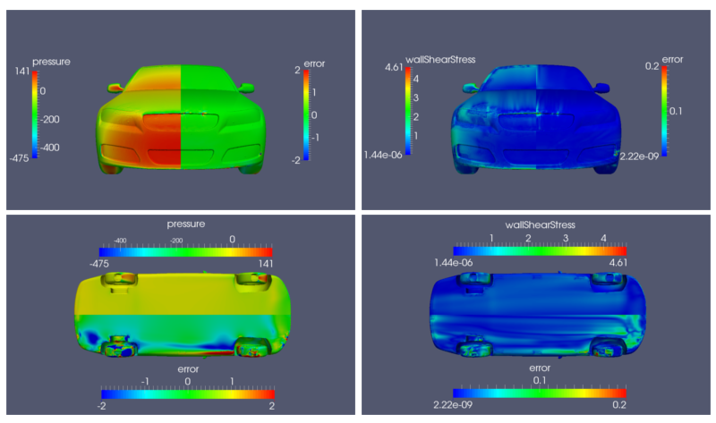

# Summary

Model Order Reduction, roughly speaking, can be summarized in two parts: an offline and an online part. In the first one constructs the database of solutions, or snapshots, for proper selected parameters. In the latter the database is used for a fast evaluation of the quatity of interest for a new parameter (see for example [@schilders2008model] and [@hesthaven2016certified]). Choices can be made either for the selection of the parameters in the construction of the database or on how the database is used to approximate the manifold of the snapshots.

EZyRB is a python library [@ezyrb] for Model Order Reduction based on baricentric triangulation for the selection of the parameter points and on Proper Orthogonal Decomposition for the selection of the modes. It is ideally suited for actual industrial problems, since its structure can interact with several simulation software simply providing the output file of the simulations. The software uses a POD interpolation approach in which the solutions are projected on the low dimensional space spanned by the POD modes [@bui2003proper], [@chinesta2016model]. The new solution is then obtained by interpolating the low rank solutions into the parametric space. This approach makes the package non intrusive with respect to the high fidelity solver actually used. This allows an easy integration into existing simulation pipelines, and it can deal with both vtk files and matlab files.

In the EZyRB package we implemented in Python the algorithms described above. We also provide tutorials that show all the characteristics of the software, from the offline part in which it is possible to construct the database of snapshots, to the online part for fast evaluations of the fields for new parameters. There are also modules to allow the consistency of all the solutions (often with different degrees of freedom) in order to process them.

As an exmaple, we show below an application taken from the automotive engineering field [@salmoiraghi2017]. In particular here we have the first POD modes of the pressure field on the DrivAer model, that is a generic car model developed at the Institute of Aerodynamics and Fluid Mechanics at the Technische Universität München to facilitate aerodynamic investigations of passenger vehicles [@wojciak2011investigation].

Here we have the DrivAer model online evaluation. On the left there is the pressure field and on the right the wall shear stress field along with the corresponding errors.

# Acknowledgements
This work was partially supported by the project HEaD, "Higher Education and Development", supported by Regione FVG — European Social Fund FSE 2014-2020, and by European Union Funding for Research and Innovation — Horizon 2020 Program — in the framework of European Research Council Executive Agency: H2020 ERC CoG 2015 AROMA-CFD project 681447 “Advanced Reduced Order Methods with Applications in Computational Fluid Dynamics” P.I. Gianluigi Rozza. We also thank Filippo Salmoiraghi for the original idea behind this package.

# References
